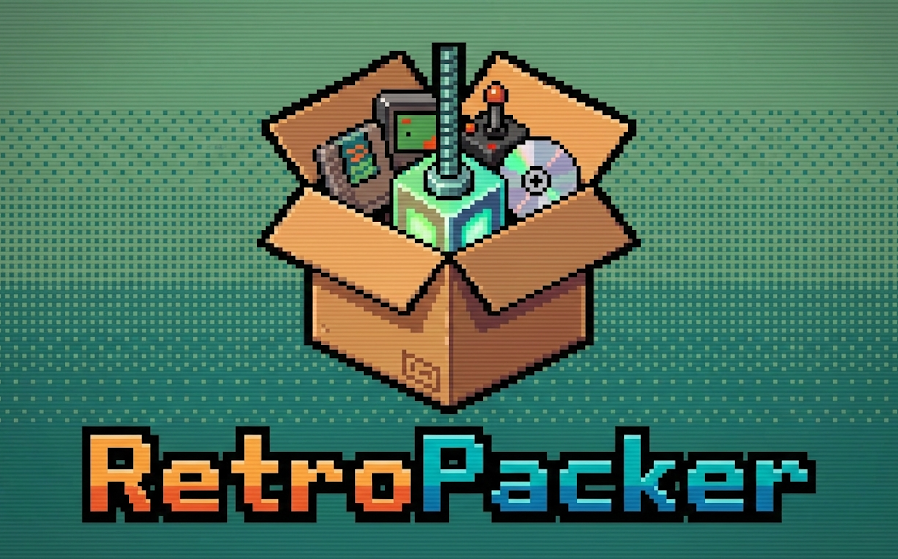

# RetroPacker 📦🎮

<p align="center">
  
</p>

A high-performance GUI application built with **Tauri and React** for managing, packing, unpacking, and verifying retro game ROMs. Easily process formats like **CHD**, **RVZ**, and **CSO** without memorizing command-line arguments for standard tools like `chdman` or `DolphinTool`.

## 🚀 Features

- **Multi-Workflow Support:**
  - **Compress:** Convert and compress your game dumps.
  - **Extract:** Decompress archives back to original disc images.
  - **Verify:** Validate the integrity of your ROMs (configurable `verifyAlgorithm`).
  - **Info:** Extract and view header information/metadata, robust game ID parsing (e.g., PSP `.iso` / `.cso`), and active cover art fetching.
- **Batch Processing & Quality-of-Life:** Supports adding massive numbers of jobs to a virtualized queue. Configurable concurrency with automatic hardware thread detection for optimal processing.
- **Robust Orchestration:** Easily Pause, Play, Clear, or Retry jobs. Features reliable internal process cancellation (prevents orphaned CLI subprocesses upon exiting or job cancellation).
- **Blazing Fast UI Updates:** Built with a specialized hybrid state model. Uses **Zustand** for global workflow signaling and **Preact Signals** for localized high-frequency job telemetry (progress bars, terminal log ingestion, ETA) to avoid React render path stuttering.
- **Deep Customization:** Configure tool-specific parameters like `extractGameOnly` via the Global Settings UI. Set custom output directories and toggle options like `deleteSourceAfterSuccess`.

## 🛠️ Supported Formats & Integrations

- **chdman (MAME):** Automates CD/DVD-based game compression (PS1, PS2, Saturn, Sega CD, etc.) to `.chd`.
- **DolphinTool:** Handles GameCube (`.iso`, `.gcm`) and Wii (`.iso`, `.wbfs`) compression/extraction to `.rvz`.
- **CSO Tooling:** Supports handling and interpreting PlayStation Portable (PSP) image variants (`.iso` / `.cso`).

## 🖥️ Tech Stack

- **Frontend:** React 19, TypeScript, Vite, Tailwind CSS, Shadcn UI
- **State Management:** Zustand (store state), `@preact/signals-core` (telemetry state)
- **Backend Core:** Rust & Tauri 2.0 (with Tauri plugins for filesystem, async HTTP, and process execution)
- **Architecture Overview:** Clean Architecture approach bridging React hooks with core Use Cases (`ProcessJobUseCase`, `ManageQueueUseCase`) and Repositories (`ICommandExecutor`). *See [ARCHITECTURE.md](./docs/ARCHITECTURE.md) for full context.*

## ⚙️ Getting Started

### Prerequisites

- [Node.js](https://nodejs.org/) (latest LTS recommended)
- [Rust](https://www.rust-lang.org/tools/install) (latest stable)
- C++ build tools required by [Tauri v2 dependencies](https://v2.tauri.app/start/prerequisites/)

### Development

```bash
# Install dependencies
pnpm install

# Start the frontend dev server and the Tauri window
pnpm run tauri dev
```

### Build for Production

```bash
# Build the React TS bundle and compile the optimized Rust binary
pnpm run tauri build
```

## 📄 License

Refer to the [LICENSE](./LICENSE) file for usage and distribution details.
